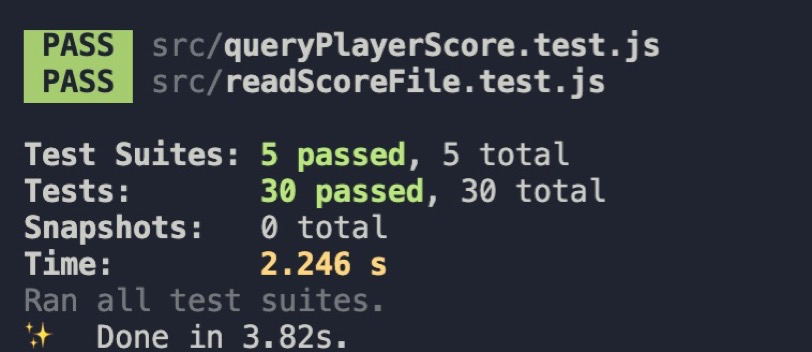
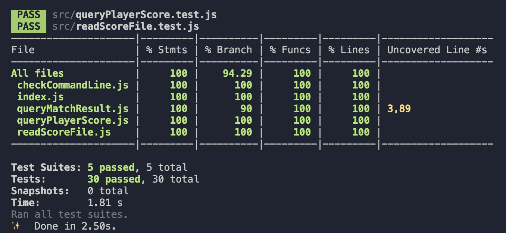

# tennis-score-caculator
This is a tennis score caculator powered by Node.js.(need node version > 10)

1. Query match result

Prints who defeated whom, and the result of the sets for the match (winning player score first).

Query: `Score Match <id>`

Example: `Score Match 01`

Example output:

    Person A defeated Person B
    2 sets to 0
 
 2.Query games for player
 
Prints a summary of games won vs lost for a particular player over the tournament
Query: `Games Player <Player Name>`

Example: `Games Player Person A`

Example output:

    23 17
    
## How to install
1.Clone repository from github

step 1: Clone the git repository to your local directory and enter the directory

    https://github.com/Jingshuai-cloud/tennis-score-code-test.git

step 2: Enter the directory tennis-score-code-test and install modules

    cd tennis-score-code-test

just simply run yarn, and then it would automatically download all the node moudules.

step 3: run the query command

yarn tennis-caculator 01 "Person A"

outcome:

    Person A defeated Person B

    2 sets to 0

    Person A  Score  [ 23,17 ]

yarn tennis-caculator 02 "Person B"

outcome: 

    Person C defeated Person A

    2 sets to 1

    Person B  Score  [ 0,12 ]

yarn tennis-caculator 02 "Person C"

outcome:

    Person C defeated Person A

    2 sets to 1

    Person C  Score  [ 17,11 ]

There are also some validations for the commandline input:

1.if the command line argument is less than 2, output would be:

For Example: yarn tennis-caculator 02 

outcome:

    Please enter the correct command:
    yarn tennis-caculator  [MatchID]  [Player Name] 

    For example: 
    yarn tennis-caculator 02 "Person A" 

 
 2.if the command line match ID is not exists, output would be:
 
For Example: yarn tennis-caculator 03 "Person A"

    There is no match 03, 
    Valid match Id are 01,02 
    Please run the command again. 
    
 3.if the command line player name is not exists, output would be:
 
For Example: yarn tennis-caculator 01 "Person D"

    There is no player Person D ,
    Valid player name are Person A,Person B,Person A,Person C
    Please run the command again.
 
 # Test-case
 
 Write 30 test case all together:
 
 
 
 Test coverage:
 
 

